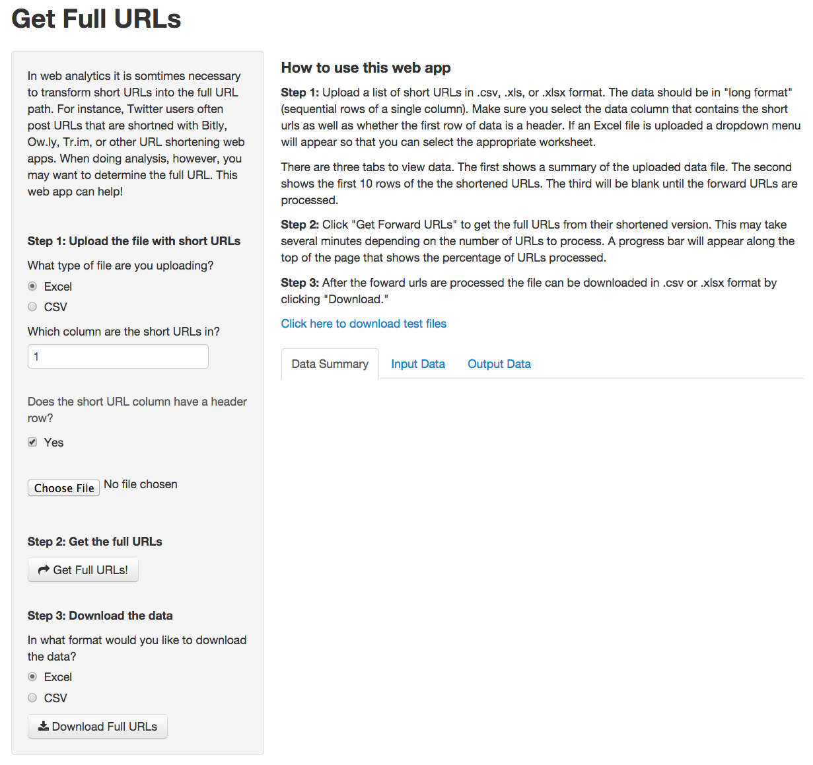
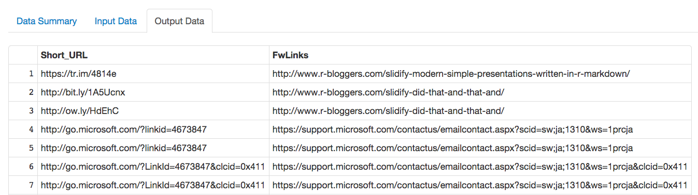

## Full URLs

When doing web analytics you sometimes need to know the full URL (this is
the final URL destination that the shortened URL forwards to).

Maybe you want to count the number of Twitter posts that lead to a particular
website, but since uers are shortening the same link with different apps,
it's impossible to total website shares unless you know where each of the 
shortened URLs ultimatly leads.

Or maybe you're analyzing an email campaign that uses many shortened links
depending on the geographic market and audience it was sent to. Ideally,
your client would hand you a mapping of the shortened URLs used in the email
and their full URL counterparts, but in practice clients, tools, and processes 
are all imperfect and you're often left having to create mappings like
this yourself.

---

## Transforming Shortened URLs
Without an automated tool you would need to go through by hand and copy each
shortened URL into the web browser to see where it ultimately leads. This can be 
prohibitively time consuming, taking 7 to 10 hours to process a thousand URLs. 
The web app I created drastically speeds up this process and allows you to continue 
doing other work while it retrieves the URLs for you.


<iframe src='assets/img/fig1.html' width=100%, height=600></iframe>

---

## My Shiny App

My app lets a user upload files in CSV or Excel format, sepecify the location
of the shortened URLs, get the full URLs, and then download the results.

<div style='text-align: center;'>
  
</div>

---

## Example Output
Below is some sample output of the Shiny app I wrote. On the left side are the shortened
links and on the right are their full counterparts. Notice there is no way to predict
where the shortened URL ultimatly leads.

<div style='text-align: center;'>
  
</div>

--- .codefont

## Challenge #1

One feature I wanted to have for my web application was the ability
for the user to select the worksheet with the shortened URLs if 
an Excel file with more than one worksheet was loaded. The basic
code outline is below.

In practice the code is a little more complicated and includes some
error checking in case an unreadable worksheet is selected.


```r
observe({
  if(input$inputformat == 'excel' & !is.null(filepath()))
    values$workbook = loadWorkbook(filepath())
    sheetNames = getSheets(values$workbook)
    output$worksheets = renderUI({
    selectInput(inputId = "dynamicinput", 
                label = "Select Worksheet",
                choices = c(sheetNames,'Select' = 'select'),
                selected = 'select')    
    })
})

# Some more code
input$data = readWorksheet(values$workbook, sheet = input$dynamicinput, header = input$dataheader)
```

--- .codefont .fontstyles
## Challenge #2

Another feature I wanted in the web app was a progress bar. The process of
getting full URLs can take 10 to 15 minutes or longer and I thought it was
important to show the user that the app was still working even if no results
were immediately displayed.

The basic code structure is shown below. A *withProgress* function is called
to initialize the progress bar and then during every loop the progress is updated.


```r
getFwLinks = function(links) {
  total = nrow(links)
  FwLinks = vector(mode = "character", length = total) # Create results vector
  withProgress(min = 0, max = total, message = paste(total, "rows detected. Getting forward links..."), {
  for(i in 1:total) {
    setProgress(value = i)
    # Get foward link of shortened URL
  }
}
```

--- .codefont

## Challenge #3

A third challenge was that I wanted to provide error messages since there
were many places the user might do something unexpected, such as try to
load a worksheet that was invalid for some reason. I wrapped statements
where I thought things could break in a try catch block.


```r
tryCatch({ readWorksheet(values$workbook, sheet = input$dynamicinput, header = input$dataheader)
                     }, error = function(e) { seterror('excelreaderror'); return() })
```

I then had a function that would take that error and produce some error
text that would then be sent to a text output object that was printed
in ui.R.


```r
seterror = function(error) {
  errormessage = switch(error,
                  'excelreaderror' =  'Error: The workbook loaded, but there was
                                       an error reading the specified worksheet',
                  # Some more possible error types
  
  output$errortext = renderUI({
    tags$div(class = "errortext", checked = NA, 
             tags$p(errormessage))
  })
}
```


